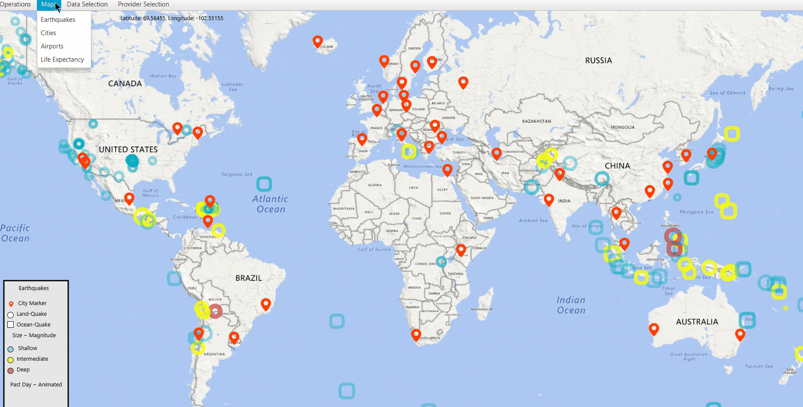
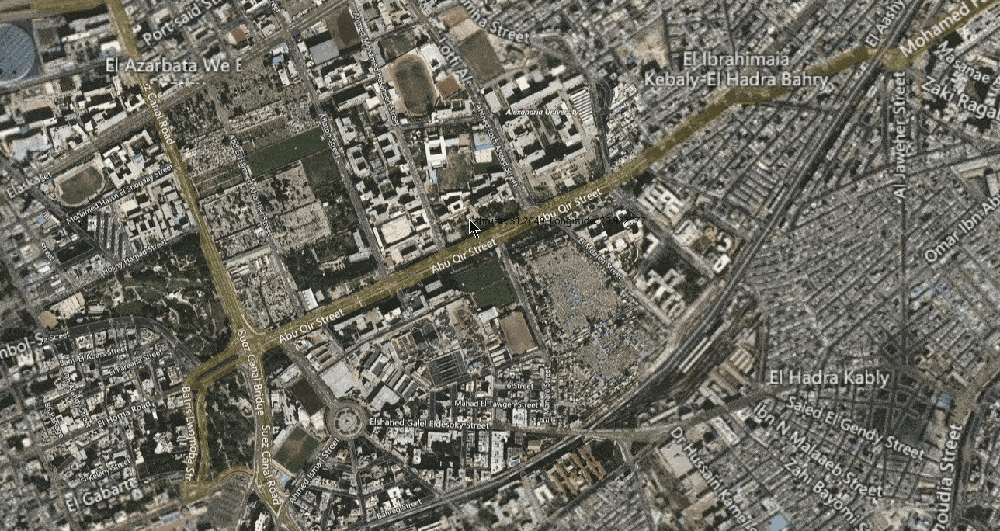
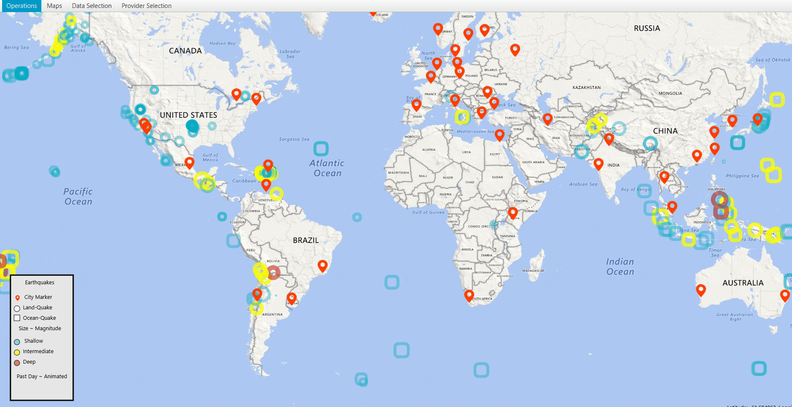
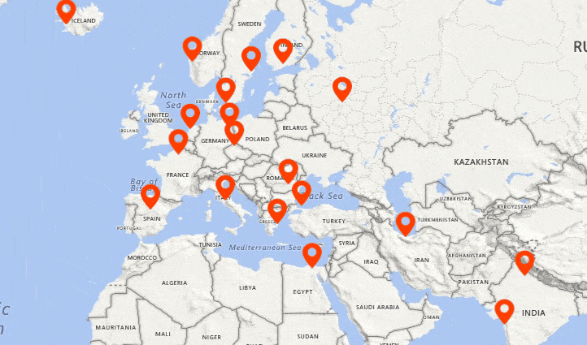
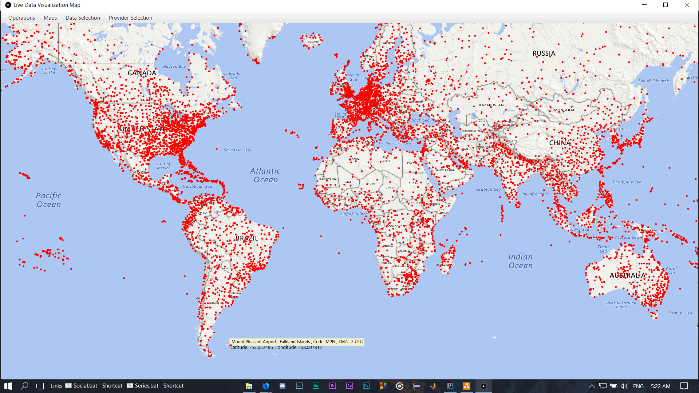
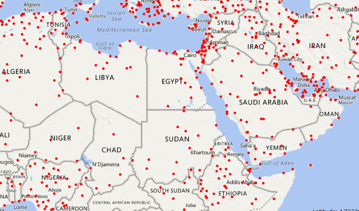
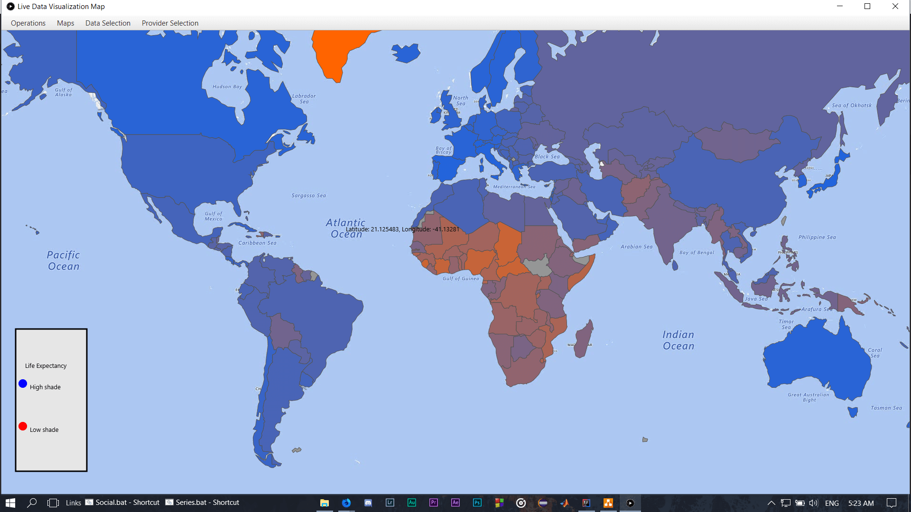

## [Project's Site](https://hisham-maged10.github.io/Live-Data-Map-Visualization-Application/)
## [Documentation](https://hisham-maged10.github.io/Live-Data-Map-Visualization-Application/documentation/overview-summary.html)
## Live Data Visualization Map  
***An Application that takes data input of locations of  certain events representing them in the form of interactive markers***

## Visualizations
***The Map Can Visualize:***

 - Live or Local Earthquake data
 - Data of Cities
 - Airports' data
 - Life-Expectancy of Humans data

**Provide** ***Functionalities* such as:**

 - **Switching between the types of visualized data.**

 - **Switching between the Satellite view of the map.**

***By default the Application opens up on Earthquakes' data of the Past-Day.***

## 
## Basic Features

 - Basic Zoom functionalities as Google Maps
 - Changing types of data using key strokes, '1' Earthquakes data, '2' Cities data, '3' Airports data, '4' Life-Expectancy data
 - Zoom in using '+' and zoom out using '-', double mouse clicks, mouse scroll
 - Movement around map using mouse clicks

 

## 

## Earthquakes Section
*A Map that visualizes the Earthquake data in the form of interactive markers.*
***Have the following functionalities:***

 - **Changing the Earthquake markers' color dynamically** based on their **depth** producing a **light blue** color for **shallow** depth, **yellow** for **moderate** and **red** for **intense**.
 - The **Increase** or **decrease** of marker's **size** dynamically based on **magnitude**.
 - **Representation** of **Earthquakes** changing their **shape** based on **where they occurred** where quakes that happened on **land** are in the form of **circles**, while on **ocean** is in the form of **rounded rectangles**.
 - **Animation** on the **size** of markers if they **occurred** in the **past hour/day** where they appear in **radiating motion**.
 

 
 - The **Ability** to **load** and **visualize** Earthquake Data from **USGS's RSS feed** in the **form of Markers** from **USGS** [https://earthquake.usgs.gov/earthquakes](https://earthquake.usgs.gov/earthquakes/map/) as **Live data** including **last hour, last day, last week** and **last month** options or **locally** from your **PC** using a file chooser. ***(Uses Xerces 2 XML Library)***

 
 
 - The **Ability** to **filter** **data** based on either or both **magnitude** and **depth** criteria with an **upper limit**, **lower limit**, **exact** ***(uses exact floating point comparison)*** or **ranged** filters **on loading of data or anytime after loading data**.
 
  
 
 - **Showing** **information** about the marker on **mouse hover** in the form of **"magnitude, depth, description about its location, age".**
 - **Clicking** **on** an Earthquake **Marker**, **hides** all **markers** on map **except** the **City** markers that are in its **Threat circle aka Epicenter**, **Plotting** a **line** between the **Earthquake** and the **city or cities it might affect**.
 - **Clicking** on a **City Marker** hides all **markers except Earthquake Markers that might affect the city.**
 
 
 
 ## 
 
## Cities Section
A Map that visualizes the Cities' data in the form of interactive markers.
***Have the following functionalities:***
 
 - The **Ability** to **load and visualize** *cities'* data of **JSON** format.
 

 
 - Have **mouse interactivity** where **hovering** on a **City** Marker **shows information** about it including **city name, country name, population of city.**

## 
## Airports Section
A Map that visualizes the Airports' data in the form of interactive markers.
***Have the following functionalities:***

 - The **Ability** to **load and visualize** *Airport's* data from https://openflights.org/ which holds live Airport data. ***(Uses Apache Commons CSV Parser library)***

 - **Hovering** on **Airport** Marker **shows information** about the airport including **airport name, airport country, ICAO (3-letter code) and Timezone in UTC**
 - **Clicking** on **Airport** Marker **hides** all **markers** on the map, **showing Lines** from the *clicked on marker* to *other airport markers* **representing** all the **existing routes** from **the clicked on marker as a source** and other visible **airports as destination**, **hiding** all the **airports** that **doesn't have a route**, **Clicking** *elsewhere* **shows all markers** returning the map to its original state.

## 
## Life-Expectancy Section
A Map that visualizes the Life-Expectancy of humans, shading the countries accordingly to represent mapped values.
***Have the following functionalities:***

 - Have the **Ability** to **load and visualize** *Life-Expectancy data* from https://data.worldbank.org/ **Mapping** the **values** to **Color values** to **represent** them **on the map** accordingly. (Uses Apache Commons' CSVParser library)
 - **Values** being **represented** where **high Life-Expectancy** *( 90 years old )* **tends** to the **blue shade** while **low Life-Expectancy** **( 45 years old )** **tends** to **the red shade.**
 
 

- Can **change** the **Life-Expectancy values** to a **certain year** from **1960 to 2017** *inclusive* **representing** the *Life-Expectancy values* of countries for that year, **the default year used is 2017**.

## 
## Project Timelapse
***Part one includes initial steps of parsing and loading Earthquakes data, life-expectancy data and initial visualization of map, Filtering API, Error handling.***

 

***Part two includes Redesign of Class Hierarchy, Full API Re-write to provide more extend-ability and ease of adding features, parsing and loading Cities' data, Airports and routes data, Adding interactivity to the map using mouse hover and mouse clicks .***

